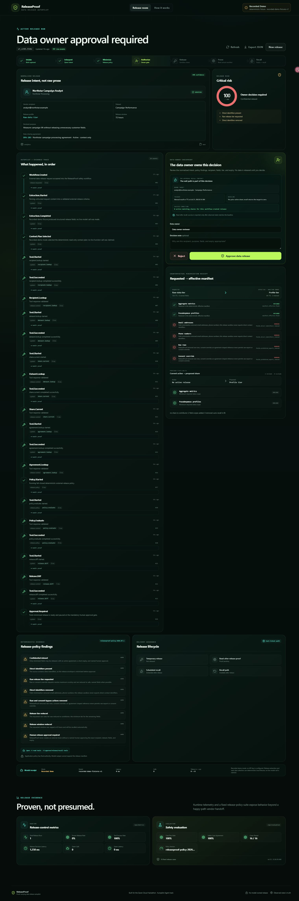
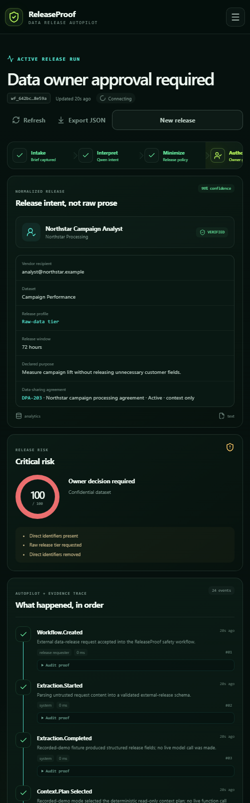

# ReleaseProof

**Proof-carrying data release autopilot powered by Qwen Cloud.**

> Every dataset release needs a recall path.

ReleaseProof turns an ambiguous request to share enterprise data with an external vendor into a minimized, expiring, reviewable release manifest. In live mode, Qwen extracts the intended recipient, dataset, purpose, fields, and TTL, then plans the evidence it needs; recorded-demo mode substitutes clearly labeled deterministic fixtures. Deterministic policy constrains or rejects the release. A data owner approves the exact manifest. A sandbox clean-room adapter creates the share idempotently, reads it back, and can recall it manually or at expiry. A hash-linked audit trail carries the proof of every step.

Built for **Qwen Cloud Hackathon — Track 4: Autopilot Agent**.

The submitted candidate is [`7a6e503eb03849d19d663597e2993b093c201738`](https://github.com/xiaodouzi666/releaseproof/commit/7a6e503eb03849d19d663597e2993b093c201738). It is deployed on Alibaba Cloud Simple Application Server at [http://8.219.184.228](http://8.219.184.228), with a public [health endpoint](http://8.219.184.228/api/health), [deployment evidence](docs/deployment-proof.md), and [demo video](https://youtu.be/s64eo9D5PYc). The candidate passed **69/69 automated tests** and **16/16 deterministic policy cases**.

The public runtime is configured as `live-qwen` with Qwen Cloud (`qwen3.7-plus`), but inference currently returns HTTP 403 `AccessDenied.Unpurchased` while Alibaba account KYC/entitlement activation remains pending. The health response proves runtime configuration, not a successful model call; ReleaseProof therefore does **not** claim a successful live-Qwen inference or workflow. The included release adapter uses synthetic data and simulated vendors. ReleaseProof is not a production DLP, data clean room, consent platform, or legal-compliance system.

Public evidence:

- [Application](http://8.219.184.228) and [health](http://8.219.184.228/api/health)
- [Public repository](https://github.com/xiaodouzi666/releaseproof) and [immutable candidate](https://github.com/xiaodouzi666/releaseproof/commit/7a6e503eb03849d19d663597e2993b093c201738)
- [Alibaba Cloud resource](docs/assets/deployment/alibaba-cloud-resource.jpg), [current runtime](docs/assets/deployment/alibaba-cloud-runtime-current.jpg), and [public app](docs/assets/deployment/public-app.jpg) captures
- [Public demo video](https://youtu.be/s64eo9D5PYc)

## Why ReleaseProof

External data sharing often begins with a sentence such as:

> Send the customer file to Northstar for the campaign analysis. They need it this week.

That request omits the facts that decide whether a release is safe:

- Which legal vendor entity and agreement?
- Which dataset revision and which fields?
- Is the agreement active and tied to that recipient?
- Can direct identifiers be removed?
- How long should access remain live?
- Who owns the data and approves the final manifest?
- Did the clean room expose exactly the approved projection?
- How will the release be recalled when consent, purpose, or risk changes?

Most release tooling focuses on publishing. ReleaseProof treats recallability and observable proof as part of the release itself.

## What it does

1. A requester supplies prose and, optionally, a ticket or agreement image.
2. In live mode, Qwen emits a typed release intent: recipient, dataset, purpose, requested fields, TTL, and optional agreement reference.
3. Qwen proposes only read-only context calls: vendor, dataset, current-release, and agreement lookups. Recorded-demo mode replaces steps 2–3 with disclosed deterministic fixtures so the rest of the workflow remains locally testable.
4. The server allow-lists those functions, validates and rebinds their arguments, completes the mandatory evidence baseline, and dispatches the reads.
5. Deterministic policy rejects unknown or unverified vendors, prohibited data classes, and requests that cannot be made safe. Otherwise it removes unnecessary fields and caps TTL.
6. A data owner reviews the exact effective manifest, policy findings, expiry, evidence receipts, and before/after release diff.
7. Approval creates a synthetic clean-room share with a stable idempotency key.
8. ReleaseProof reads the share back and reports completion only when the observed recipient/dataset target, release tier, fields, and expiry match the approved manifest.
9. Expiry or an operator-initiated recall removes the share and verifies that it is no longer active.
10. Every model, tool, policy, approval, release, verification, and recall event is appended to a prior-hash-linked audit chain.

Recorded-demo owner checkpoint — desktop and mobile

## The proof carried by a release

A ReleaseProof manifest is more than a generated summary. Its evidence packet binds:

- the normalized request and source mode;
- resolved vendor and dataset identities;
- the agreement evidence and declared purpose recorded for policy/review;
- the policy version and every constraint or denial;
- requested versus effective fields and TTL;
- the named data-owner decision;
- a stable idempotency key;
- the observed post-release state;
- recall/expiry status; and
- the audit-chain head.

The prototype keeps this packet in its workflow and audit store. A production implementation would sign the manifest, anchor audit heads externally, and issue provider-native clean-room entitlements.

## Qwen Cloud integration

With **DASHSCOPE_API_KEY** configured, the server calls the Qwen Cloud OpenAI-compatible Chat Completions endpoint:

~~~text
POST https://dashscope-intl.aliyuncs.com/compatible-mode/v1/chat/completions
Authorization: Bearer <server-only key>
model: qwen3.7-plus
~~~

A normal live workflow makes two logical model calls:

1. **Structured extraction** — Qwen turns prose and optional imagery into the typed release intent.
2. **Read-plan generation** — Qwen selects from vendor lookup, dataset lookup, current-release lookup, and optional agreement lookup.

The returned plan is untrusted. The server rejects unknown or malformed calls, replaces identifiers with validated extraction values, adds any mandatory evidence reads Qwen omitted, and dispatches the sanitized plan. Qwen is never offered a release, recall, approval, or policy-override function.

The primary and fallback model are configurable. Provider mode, selected model, fallback use, call count, latency, and token metadata are recorded per workflow without exposing credentials.

On the submitted Alibaba Cloud deployment, the key, endpoint, and primary model are configured and the runtime truthfully reports `live-qwen`. Attempts to perform the model-dependent steps currently fail closed at the Qwen boundary with HTTP 403 `AccessDenied.Unpurchased` while account KYC/entitlement activation remains pending. No successful live call is represented in this repository or submission evidence.

Official references:

- [Qwen Cloud first API call](https://docs.qwencloud.com/developer-guides/getting-started/first-api-call)
- [Qwen structured output](https://www.alibabacloud.com/help/en/model-studio/qwen-structured-output)
- [Qwen function calling](https://www.alibabacloud.com/help/en/model-studio/qwen-function-calling)
- [Qwen visual understanding](https://www.alibabacloud.com/help/en/model-studio/vision-model)

## Architecture

~~~mermaid
flowchart LR
    U[Requester text or image] --> API[ReleaseProof API]
    API --> Q[Qwen extraction and read plan]
    Q --> G[Schema and tool boundary]
    G --> T[Vendor, dataset, current-release, agreement reads]
    T --> P[Deterministic release policy]
    P --> O{Data-owner approval}
    O -->|approve exact manifest| C[Sandbox clean-room adapter]
    O -->|reject| X[Closed without release]
    C --> V[Read-after-release verifier]
    V --> R[Expiry or manual recall]
    R --> RV[Read-after-recall verifier]
    API --> A[Hash-linked audit]
    Q --> A
    T --> A
    P --> A
    O --> A
    C --> A
    V --> A
    R --> A
~~~

The browser and API ship as one Node.js container. Express serves the built Vite app and the API; model credentials remain server-side. See [docs/architecture.md](docs/architecture.md) for the state machine, trust boundaries, failure behavior, and deployment topology.

## Honest recorded-demo mode

ReleaseProof remains explorable without a paid key. Preset scenarios always use clearly labeled deterministic extraction and read-plan fixtures, including on a server configured for live Qwen; custom requests use the configured live client and fail closed if both models fail. If **DASHSCOPE_API_KEY** is absent, every workflow uses recorded-demo mode. The same sanitizer, context tools, policy, approval transition, sandbox release, verification, recall, metrics, and audit paths still run.

Recorded-demo output is never represented as a live Qwen result. The UI and health response disclose the active provider mode. The submitted cloud runtime is configured for live Qwen, but its current 403 `AccessDenied.Unpurchased` response means the deterministic recorded-demo path remains the reproducible end-to-end workflow evidence.

## Quick start

Requirements: Node.js 22.13+ and pnpm.

~~~bash
pnpm install
cp .env.example .env
pnpm dev
~~~

Open http://localhost:5173. An empty **DASHSCOPE_API_KEY** selects recorded-demo mode.

Production-style local run:

~~~bash
pnpm build
PORT=8787 pnpm start
~~~

Open http://localhost:8787 and verify http://localhost:8787/api/health.

Public source: [github.com/xiaodouzi666/releaseproof](https://github.com/xiaodouzi666/releaseproof)

### Environment variables

| Variable | Required | Default | Purpose |
| --- | --- | --- | --- |
| DASHSCOPE_API_KEY | Live Qwen only | empty | Server-only Qwen Cloud API key |
| QWEN_BASE_URL | No | shared Singapore endpoint | OpenAI-compatible Qwen Cloud base URL |
| QWEN_MODEL | No | qwen3.7-plus | Primary extraction/planning model |
| QWEN_FALLBACK_MODEL | No | qwen3.6-flash | Lower-latency fallback |
| QWEN_MAX_CONCURRENCY | No | 2 | Maximum simultaneous model calls |
| PORT | No | 8787 | HTTP port |
| AUDIT_STORE | No | file | Workflow/audit persistence adapter |
| RELEASEPROOF_DATA_FILE | No | ./data/releaseproof-store.json | File-store path |
| DEMO_STEP_DELAY_MS | No | 420 | Optional visible workflow pacing |
| DEPLOYMENT_TARGET | No | local | Truthful runtime label |
| CORS_ORIGINS | No | empty | Optional separate-frontend allow-list |
| WORKFLOW_CREATE_LIMIT_PER_MINUTE | No | 12 locally | Process-local workflow creation cap |

Never use a Vite-prefixed variable for the API key and never commit the local environment file.

## Workflow states

~~~text
queued -> extracting -> planning -> enriching_context -> evaluating_policy
evaluating_policy -> denied
evaluating_policy -> awaiting_approval -> approved -> executing -> verifying -> completed
awaiting_approval -> rejected
completed -> rolling_back -> rolled_back
active processing states -> failed
~~~

The public UI describes `executing` as creating a release and `rolling_back` / `rolled_back` as recalling / recalled. The generic internal state names are retained for contract compatibility. The server owns legal transitions: a client cannot jump from request creation to release, a denial has no approval path, and completion requires observed-state agreement.

## Safety properties

- **Fail closed:** malformed model output, unknown vendors/datasets, missing required agreement evidence, and prohibited fields stop the release.
- **Data minimization:** policy computes the effective projection and TTL; request prose cannot expand them.
- **Exact owner checkpoint:** approval targets the effective manifest, not the original vague request.
- **Constrained tools:** the model sees read-only evidence functions, never the clean-room write adapter.
- **Idempotent publication:** retries with the same workflow revision do not create duplicate shares.
- **Observed success:** a write acknowledgement is insufficient; the recipient/dataset target, field projection, release tier, uniqueness, and expiry are read back.
- **Recallability:** an approved share can be recalled, and the absence/revocation is observed before success is reported.
- **Tamper evidence:** each audit event commits to its predecessor hash.
- **Provider honesty:** live Qwen and deterministic fixture modes remain visibly distinct.

See [docs/security.md](docs/security.md) for the threat model and production gaps.

## Testing and evaluation

~~~bash
pnpm typecheck
pnpm test
pnpm eval
pnpm build
~~~

The deterministic evaluation focuses on release-policy invariants such as vendor verification, field minimization, agreement validity, TTL caps, no release after denial, idempotency, exact-state verification, and verified recall. Do not copy historical test totals into a submission; record results from the final submitted commit. See [docs/evaluation.md](docs/evaluation.md).

Fresh validation of candidate [`7a6e503eb03849d19d663597e2993b093c201738`](https://github.com/xiaodouzi666/releaseproof/commit/7a6e503eb03849d19d663597e2993b093c201738) passed typecheck, production build, production dependency audit, **69/69 tests**, and **16/16 deterministic evaluation cases**.

## Deployment

The submitted candidate runs with Docker Compose on Alibaba Cloud Simple Application Server:

~~~bash
docker compose -f deploy/ecs/docker-compose.prod.yml up --build -d
docker compose -f deploy/ecs/docker-compose.prod.yml ps
curl --fail http://127.0.0.1:8787/api/health
~~~

The public judge URL is [http://8.219.184.228](http://8.219.184.228), and its [health endpoint](http://8.219.184.228/api/health) reports `deploymentTarget: alibaba-sas`. The current public endpoint is HTTP; TLS has not been configured, so the documentation does not claim HTTPS. The image runs as an unprivileged user. Production Compose publishes the application only on loopback so a reverse proxy can terminate TLS. The included Function Compute manifest remains an explicitly non-submission architecture experiment because the current background workflow, expiry timers, and single-instance store require a stable process.

Deployment guide: [deploy/README.md](deploy/README.md). Evidence checklist: [docs/deployment-proof.md](docs/deployment-proof.md).

## Known limitations

- Vendor, dataset, agreement, and current-release catalogs are synthetic fixtures.
- The clean-room adapter is a sandbox and does not publish real customer data.
- Destination region and residency constraints are not represented or enforced in this prototype.
- This is not a production DLP, privacy, consent, legal-review, or data-governance system.
- File persistence supports a single demo instance, not concurrent replicas.
- Expiry uses prototype orchestration; production needs a durable scheduler.
- Data-owner labels are not authenticated identities in the public demo.
- The audit chain is tamper-evident, not independently signed or immutable.
- Recorded-demo mode proves the workflow controls, not Qwen extraction quality.
- The submitted runtime's Qwen inference currently returns HTTP 403 `AccessDenied.Unpurchased` while account KYC/entitlement activation is pending; configuration is verified, successful live-model behavior is not.
- Real deployment requires SSO, owner authorization, CSRF/replay protection, transactional state, KMS-managed secrets, provider-scoped credentials, privacy review, and external security testing.

## Judging alignment

| Criterion | ReleaseProof evidence |
| --- | --- |
| Innovation and AI creativity | Qwen multimodal structured extraction plus constrained read-plan generation for a recallable data-release workflow |
| Technical depth and engineering | Typed state machine, schema/tool boundary, deterministic minimization policy, exact manifest approval, idempotent release, observed-state verification, recall, and hash-linked evidence |
| Problem value and impact | Makes external data sharing safer and operationally reversible without pretending policy can be delegated to a prompt |
| Presentation and documentation | Public Alibaba Cloud deployment, immutable source candidate, runtime captures, deterministic evaluation, threat model, architecture, evidence checklist, and public demo video |

## Documentation

- [Architecture](docs/architecture.md)
- [Security and threat model](docs/security.md)
- [Evaluation methodology](docs/evaluation.md)
- [Deployment evidence checklist](docs/deployment-proof.md)
- [Final judging and submission alignment](docs/judging-alignment.md)
- [Demo script](docs/demo-script.md)
- [Devpost submission copy](docs/devpost-submission.md)
- [YouTube description copy](docs/youtube-description.md)
- [Build-story draft](docs/build-story.md)

## License

[MIT](LICENSE) © 2026 ReleaseProof contributors.
