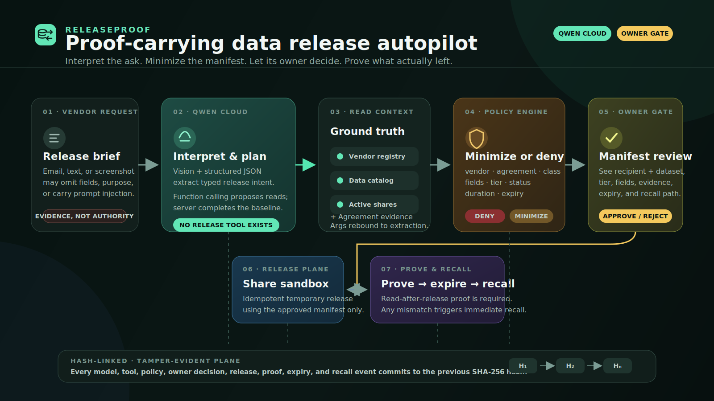
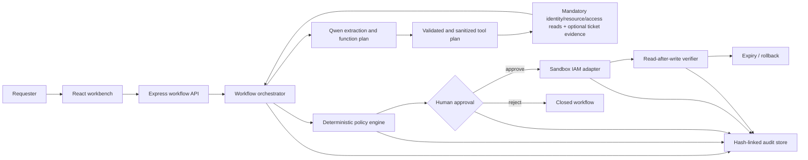
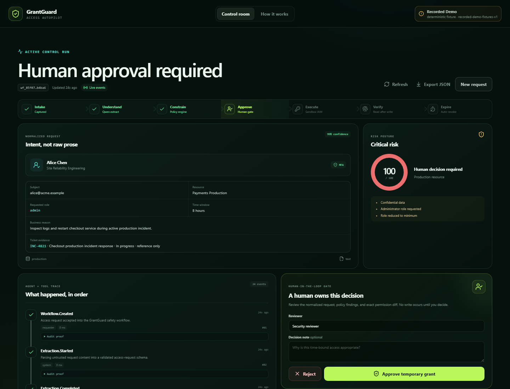
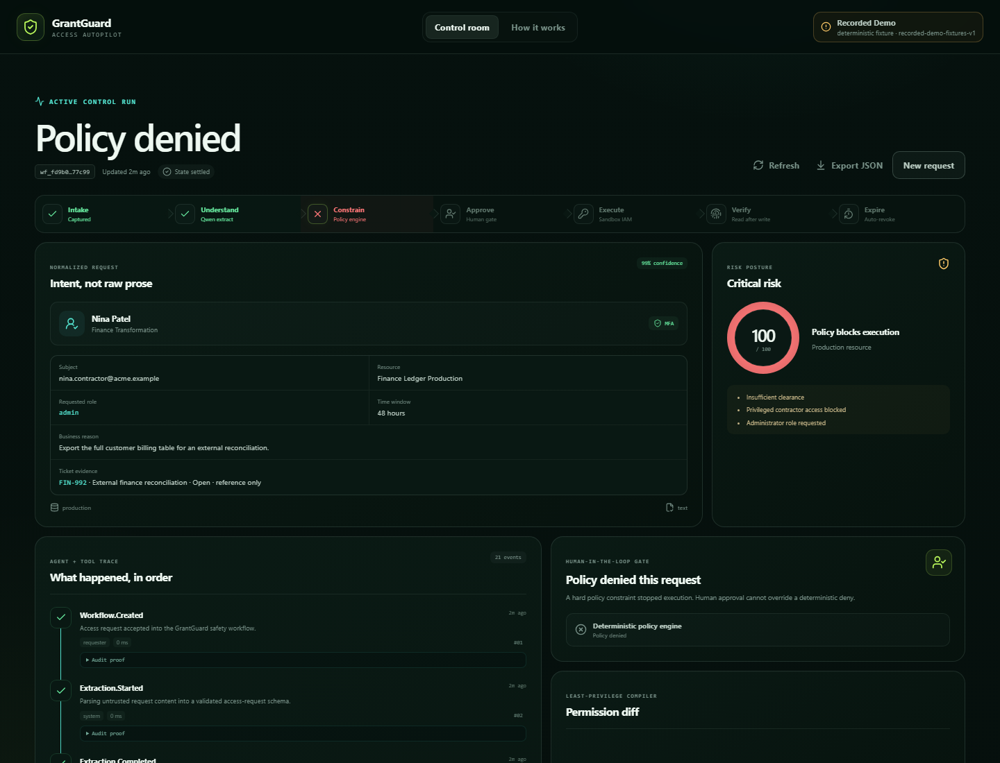
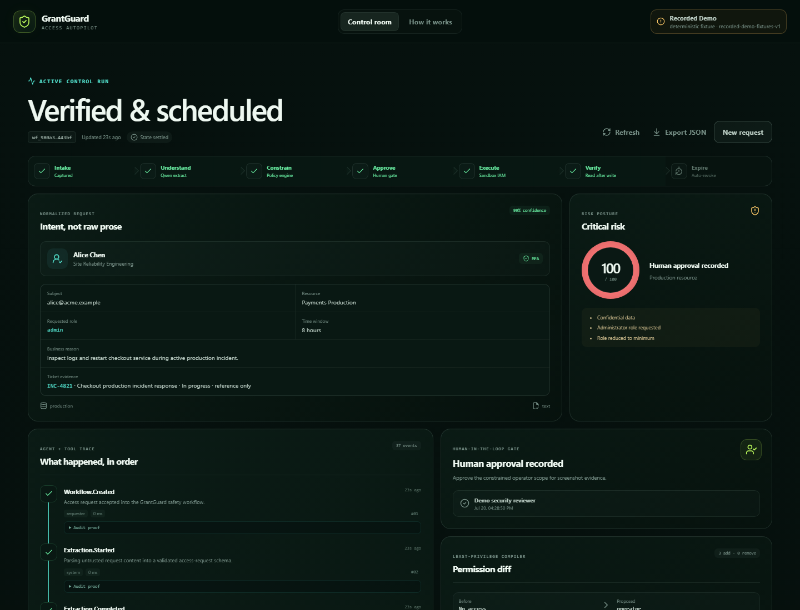
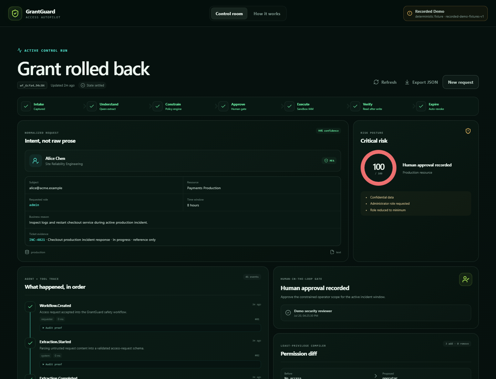

# GrantGuard

**Human-gated, least-privilege access autopilot powered by Qwen Cloud.**

GrantGuard turns an ambiguous access request into a bounded, reviewable, temporary access change. Qwen understands the request and plans the investigation; deterministic policy code owns the decision boundary; a human authorizes every privilege-creating write; and a sandbox IAM adapter makes the result verifiable and reversible. Revocation is pre-authorized by the approved expiry and may run automatically.

> Built for **Qwen Cloud Hackathon - Track 4: Autopilot Agent**. Cloud deployment and live-model evidence are not claimed until the checklist in [`docs/deployment-proof.md`](docs/deployment-proof.md) is completed with public links and unredacted service identity (never secrets).

## Why GrantGuard

Access requests usually arrive as prose, screenshots, or hurried tickets: "Give Alex production access for the migration." The real work begins after that sentence. An operator has to identify the subject and resource, inspect current access, reconcile security policy, reduce scope, select an expiry, obtain approval, execute safely, verify the result, and preserve an audit trail.

GrantGuard compresses that loop without hiding the controls:

- **Understands messy requests:** Qwen extracts a typed access intent from text and optional ticket imagery.
- **Plans with tools:** the agent inspects directory identity, current grants, and resource metadata, and can optionally retrieve reference-only ticket evidence before proposing a change.
- **Enforces least privilege:** deterministic rules may narrow duration, role, and actions, or deny the request outright.
- **Stops before privilege creation:** every permitted grant enters a visible human approval checkpoint; its approved expiry pre-authorizes automatic revocation.
- **Executes safely:** grants use idempotency keys, read-after-write verification, explicit expiry, and one-click rollback.
- **Explains every step:** a hash-linked audit timeline records model, policy, tool, approval, execution, and verification events.

## The control boundary

```text
Qwen proposes -> policy code constrains -> human authorizes -> sandbox IAM executes -> verifier observes
```

The model never receives an unrestricted IAM credential and never directly mutates access. A Qwen suggestion cannot override a deterministic deny. This is the core product decision: use a capable model where ambiguity exists, and conventional code where authorization must be predictable.

## Qwen Cloud integration

When `DASHSCOPE_API_KEY` is present, the server calls Alibaba Cloud Model Studio through its OpenAI-compatible Chat Completions API:

```text
POST ${QWEN_BASE_URL}/chat/completions
Authorization: Bearer ${DASHSCOPE_API_KEY}
model: qwen3.7-plus
```

A normal live workflow makes two logical calls to that endpoint: structured extraction with `response_format: { type: "json_object" }`, followed immediately by function planning over `directory_lookup`, `resource_lookup`, `access_current`, and optional `ticket_lookup`. Both calls disable thinking for bounded, machine-readable latency; planning requires a tool result and permits parallel independent reads. The server validates and sanitizes calls, rebinds every argument to validated extraction, always completes the three mandatory identity/resource/current-access reads, and accepts `ticket_lookup` only when extraction produced a ticket ID. Ticket evidence is reference-only and never authorizes scope. This describes the implemented path; a successful live invocation is not claimed until the deployment-proof checklist is completed.

Qwen is used for work that is meaningfully model-dependent:

1. **Multimodal intent extraction** - interpret free-form text and, when supplied, ticket imagery.
2. **Structured output** - return a JSON access request that is parsed and then validated with Zod; malformed or out-of-domain output fails closed.
3. **Function calling / context planning** - propose mandatory directory, governed-resource, and current-access reads plus optional reference-only ticket evidence before policy evaluation.
4. **Constrained dispatch** - the server validates the selected function names, parses and sanitizes their arguments back to the extracted subject/resource, adds any mandatory read that Qwen omitted, and then executes the plan.
5. **Fallback routing** - `qwen3.6-flash` can be used if the primary model is unavailable; the workflow records whether fallback occurred.

The default Singapore shared endpoint in `.env.example` remains supported by Model Studio. A workspace-specific domain is recommended for production isolation and throughput. See Alibaba Cloud's official documentation for [base URLs](https://www.alibabacloud.com/help/en/model-studio/base-url), [structured output](https://www.alibabacloud.com/help/en/model-studio/qwen-structured-output), [function calling](https://www.alibabacloud.com/help/en/model-studio/qwen-function-calling), and [visual understanding](https://www.alibabacloud.com/help/en/model-studio/vision-model).

### Honest demo mode

GrantGuard remains explorable without a paid key. If `DASHSCOPE_API_KEY` is absent, the server runs **recorded-demo** mode using deterministic extraction and context-plan fixtures. The orchestrator still dispatches the mandatory directory/resource/current-access reads, adds ticket evidence only for fixtures with a validated ticket ID, and uses the same policy, approval, IAM sandbox, verification, rollback, metrics, and audit code paths. The UI and `/api/health` disclose the active provider mode; demo output is never represented as a live Qwen response.

## Architecture





The browser and API ship as one deployable Node.js service. Express serves the built Vite app and `/api/*`; secrets stay server-side. See [`docs/architecture.md`](docs/architecture.md) for the workflow state machine, trust boundaries, and deployment topology.

## Product walkthrough

These captures come from the production build in recorded-demo mode, so they prove the guarded workflow and UI without claiming a live Qwen invocation or cloud deployment.

| Human approval gate | Deterministic policy veto |
| --- | --- |
|  |  |
| **Verified temporary grant** | **Verified rollback** |
|  |  |

## Quick start

Requirements: Node.js 20+ and pnpm.

```bash
pnpm install
cp .env.example .env
pnpm dev
```

Open `http://localhost:5173`. With an empty `DASHSCOPE_API_KEY`, the app starts in clearly labeled recorded-demo mode. To exercise live Qwen Cloud, add a Model Studio API key to `.env` and restart the API process. Never put the key in a `VITE_*` variable or commit `.env`.

Production-style local run:

```bash
pnpm build
PORT=8787 pnpm start
```

Open `http://localhost:8787` and verify `http://localhost:8787/api/health`.

### Environment variables

| Variable | Required | Default | Purpose |
| --- | --- | --- | --- |
| `DASHSCOPE_API_KEY` | For live Qwen | empty | Server-only Alibaba Cloud Model Studio API key. Empty selects recorded-demo mode. |
| `QWEN_BASE_URL` | No | `https://dashscope-intl.aliyuncs.com/compatible-mode/v1` | OpenAI-compatible Model Studio base URL; key and region must match. |
| `QWEN_MODEL` | No | `qwen3.7-plus` | Primary extraction/planning model. |
| `QWEN_FALLBACK_MODEL` | No | `qwen3.6-flash` | Lower-latency fallback model. |
| `QWEN_MAX_CONCURRENCY` | No | `2` | Maximum simultaneous Model Studio calls; additional calls wait for a slot. |
| `PORT` | No | `8787` | HTTP port for the API and production web app. |
| `AUDIT_STORE` | No | `file` | Audit persistence adapter (`file` or `memory`). |
| `GRANTGUARD_DATA_FILE` | No | `./data/grantguard-store.json` | File-store path when `AUDIT_STORE=file`; the container sets `/app/data/grantguard-store.json`. |
| `DEMO_STEP_DELAY_MS` | No | `420` | Optional pacing for visible demo workflow steps. |
| `DEPLOYMENT_TARGET` | No | `local` | Deployment label returned by health telemetry (for example `alibaba-ecs`). |
| `CORS_ORIGINS` | No | empty | Optional comma-separated browser-origin allow-list; empty keeps the API same-origin only. |
| `WORKFLOW_CREATE_LIMIT_PER_MINUTE` | No | `12` locally; ECS manifest defaults to `1` | Process-local cap on new workflows. Keep the public live-Qwen judge deployment at one request/minute or lower, and also configure Model Studio quota/spend alerts. |

## API and workflow

The UI is the primary interface. The API exposes health, scenarios, workflows, approval/rejection, rollback, metrics, and deterministic evaluation endpoints under `/api`. Exact payloads share the TypeScript contracts in [`shared/contracts.ts`](shared/contracts.ts).

The workflow is intentionally explicit:

```text
queued -> extracting -> planning -> enriching_context -> evaluating_policy
evaluating_policy -> denied
evaluating_policy -> awaiting_approval -> approved -> executing -> verifying -> completed
awaiting_approval -> rejected
completed -> rolling_back -> rolled_back
active processing states -> failed (on unrecoverable error)
```

Only an approved, non-denied plan may reach the write adapter. Repeated execution with the same idempotency key does not create a second grant.

## Safety model

- **Fail closed:** invalid model JSON, unknown identities/resources, inactive accounts, policy denies, and verification mismatches stop the workflow.
- **Deterministic authority:** role, action, environment, classification, duration, MFA, and employment-status constraints are code, not prompt text.
- **Human gate:** approval is a server-side state transition, not a visual-only confirmation.
- **Constrained tools:** the context catalogue is allow-listed; arguments are validated and replaced with trusted extracted identifiers before dispatch; three grounding reads are mandatory; ticket evidence is optional and reference-only; write operations are outside the model tool loop.
- **Temporary by construction:** every sandbox grant has an explicit expiry.
- **Idempotent and reversible:** execution uses a stable key; rollback is verified against observed state.
- **Tamper evidence:** every audit event includes the prior hash and its own hash.
- **No secret in the browser:** Model Studio credentials are read only by the server.

This prototype demonstrates a security architecture; it is **not** a production IAM system. See [`docs/security.md`](docs/security.md) for assets, threats, mitigations, and production gaps.

## Testing and evaluation

```bash
pnpm typecheck
pnpm test
pnpm eval
pnpm build
```

`pnpm eval` runs a deterministic 16-case safety suite and reports per-case outcome/risk agreement plus safety-invariant coverage. It does not grade model prose and does not call a live model. This isolates the authorization boundary from model nondeterminism. No pass rate is claimed in this README; generate and retain the current output as evidence before submission.

The methodology and expected cases are documented in [`docs/evaluation.md`](docs/evaluation.md).

## Deployment

### Docker / Alibaba Cloud ECS or Simple Application Server

```bash
docker compose up --build -d
docker compose ps
curl --fail http://127.0.0.1:8787/api/health
```

The multi-stage [`Dockerfile`](Dockerfile) builds the Vite frontend and TypeScript server, then starts `dist-server/server/index.js` as an unprivileged user. [`deploy/ecs/`](deploy/ecs/) contains the hardened production Compose and Nginx reverse-proxy examples.

### Function Compute experiment (not a submission deployment)

[`deploy/function-compute/`](deploy/function-compute/) preserves an explicitly experimental Serverless Devs `fc3` custom-container manifest. It is **not** suitable for GrantGuard's submitted live app: response-time freezing, non-sticky concurrent instances, ephemeral memory, and generated-URL browser behavior conflict with the current background workflow/expiry timers and local state store. Use the ECS path above for competition evidence. The FC manifest is only a starting point for a future architecture with synchronous or durable async jobs, a transactional external store, and a verified custom domain.

Full instructions: [`deploy/README.md`](deploy/README.md). Proof checklist: [`docs/deployment-proof.md`](docs/deployment-proof.md).

## Known limitations

- The included IAM provider is a sandbox simulation; it does not mutate a real cloud account.
- File-backed workflow/audit state is suitable for a single demo instance, not concurrent production replicas.
- Expiry is represented and testable in the workflow, but a durable distributed scheduler would be required in production.
- Identity and resource directories are fixtures rather than enterprise connectors.
- The public judge build is a fixture-only sandbox: mutation endpoints require JSON and an explicit actor label, but that label is not authenticated and no real IAM or employee data may be connected.
- Hash linking is tamper-evident, not independently anchored or signed.
- Recorded-demo mode proves orchestration and safety behavior, not live model quality.
- A production rollout would require SSO, approver authorization, CSRF protection, rate limits, encrypted durable storage, KMS-managed secrets, and external security review.

## Hackathon judging alignment

| Criterion | Evidence in GrantGuard |
| --- | --- |
| Innovation & Qwen use | Multimodal/structured intent extraction and tool planning applied to an operational access-control problem, with provider-mode telemetry. |
| Technical execution | Typed state machine, schema validation, deterministic policy, human checkpoint, idempotent write adapter, read-after-write verification, rollback, and hash-linked audit. |
| Impact & usefulness | Replaces a slow, error-prone ticket-to-access loop with a legible least-privilege proposal while retaining operator control. |
| Completeness & presentation | Runnable UI/API, 16-case safety evaluation, Docker/Alibaba Cloud deployment path, architecture/security docs, and a sub-three-minute demo script. |

## Documentation

- [`docs/architecture.md`](docs/architecture.md) - system, state machine, and trust boundaries
- [`docs/security.md`](docs/security.md) - threat model and production hardening gaps
- [`docs/evaluation.md`](docs/evaluation.md) - 16-case deterministic evaluation methodology
- [`docs/deployment-proof.md`](docs/deployment-proof.md) - competition evidence checklist
- [`docs/demo-script.md`](docs/demo-script.md) - 2:40 video shot list and narration
- [`docs/devpost-submission.md`](docs/devpost-submission.md) - ready-to-paste project submission copy
- [`docs/build-story.md`](docs/build-story.md) - public build-story draft

## License

[MIT](LICENSE) (c) 2026 GrantGuard contributors.
