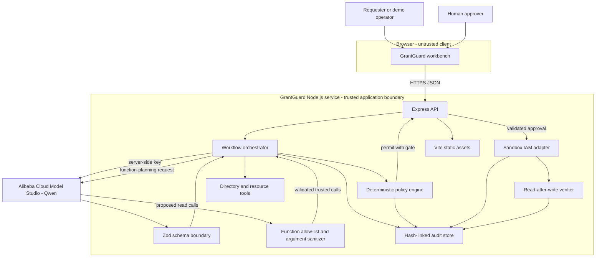
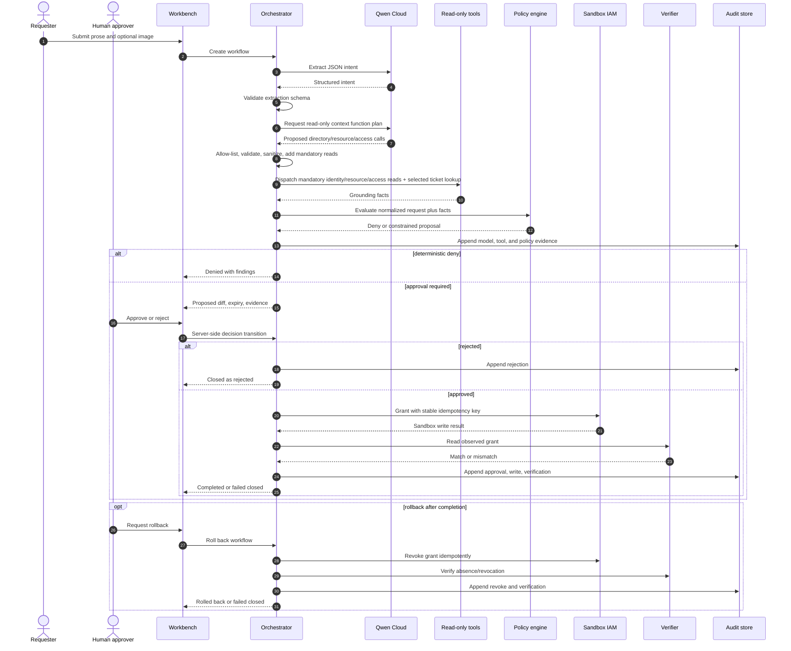
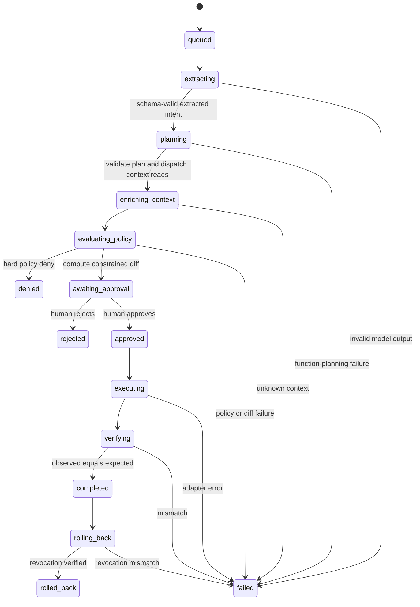
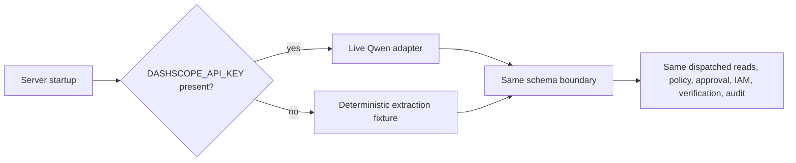
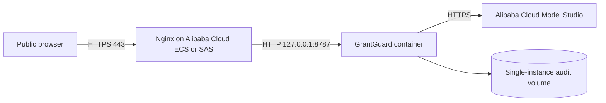

# GrantGuard architecture

GrantGuard is a human-gated agent system for temporary, least-privilege access changes. Its architecture separates probabilistic interpretation from deterministic authorization and separates authorization from side effects.

## Design principle

```text
Qwen proposes -> policy code constrains -> human authorizes -> sandbox IAM executes -> verifier observes
```

No model response is itself an authorization. The model operates on an allow-listed planning surface; the deterministic policy engine owns hard constraints; and the write adapter is reachable only after a valid server-side approval transition.


## System context



## Responsibilities

| Component | Responsibility | Explicitly does not do |
| --- | --- | --- |
| React workbench | Collect request input, visualize plan/diff/traces, capture approval or rejection, request rollback | Hold a Model Studio secret; decide policy |
| Express API | Validate requests, expose workflow transitions, serve production frontend, report non-secret health | Trust client-supplied workflow state |
| Workflow orchestrator | Advance legal states, coordinate Qwen and tools, persist evidence | Override a policy denial |
| Qwen adapter | Extract typed intent and propose directory, resource, current-access, and optional ticket-evidence functions | Execute tools, decide policy, produce the policy explanation, execute IAM writes, or approve itself |
| Zod/tool boundary | Parse structured extraction, allow-list function names, validate arguments, replace identifiers with trusted extracted values, and add omitted mandatory reads | Repair unsafe access intent silently or dispatch model-supplied identifiers directly |
| Context tools | Return fixture identity, current-access, resource, and reference-only ticket facts | Accept arbitrary function names or external URLs; treat a ticket as authorization |
| Policy engine | Apply hard identity/resource/role/action/duration rules and compute outcome/risk | Delegate a hard authorization rule to a prompt |
| Human gate | Record an actor-labeled approval/rejection and note (the prototype does not authenticate that label) | Change a denied plan into an allowed one |
| Sandbox IAM | Apply/revoke a temporary simulated grant with idempotency | Modify a real Alibaba Cloud account |
| Verifier | Read observed state after grant/revoke and compare with expectation | Treat a write response as proof of state |
| Audit store | Append ordered, prior-hash-linked events | Provide immutable external anchoring |

## Request lifecycle



## State machine



Terminal states are `denied`, `rejected`, `rolled_back`, and `failed`. `completed` is stable but may transition to rollback. State transitions are enforced on the server; a client cannot jump from `queued` to `executing`.

## Data flow and minimization

1. The API accepts request text and optionally an image representation within configured size limits.
2. Qwen receives that untrusted content for structured intent extraction; the returned fields cross a Zod boundary. Enumerated roles, numeric durations, resource IDs, actions, confidence, and source are type-checked.
3. The validated extraction is sent to a second Qwen function-calling step with `directory_lookup`, `resource_lookup`, `access_current`, and optional `ticket_lookup` definitions. Accepted calls are normalized to `directory.lookup`, `resource.lookup`, `access.current`, and `ticket.lookup` traces.
4. The server ignores unknown/duplicate/malformed calls, replaces accepted arguments with validated extracted identifiers, appends any of the three mandatory grounding reads Qwen omitted, and discards `ticket.lookup` unless extraction contains a ticket ID.
5. The orchestrator dispatches those actual reads. Their results and the normalized request, not secrets, enter deterministic policy evaluation.
6. The policy engine emits human-readable findings, a bounded effective role/action set, maximum duration, risk, and outcome; the UI renders those deterministic facts and the computed diff.
7. Only the constrained proposal reaches the human. Only the workflow ID plus approval identity/note returns to the server.
8. The IAM adapter receives the effective proposal, expiry, and idempotency key. It never receives the original prompt.
9. Audit events store operational evidence. A production system should redact/tokenize personal data and define retention before persistence.

## Safety invariants

These conditions must hold regardless of Qwen output:

1. A `deny` decision has no path to `approved` or `executing`.
2. A write requires a recorded human approval for the same workflow revision.
3. The executed role, actions, and expiry equal the policy-constrained values, not the raw request.
4. Unknown/inactive subjects and unknown resources fail closed.
5. Disallowed roles/actions are removed or denied according to deterministic policy.
6. Every grant has an expiry and an idempotency key.
7. Completion requires read-after-write agreement.
8. Rollback completion requires read-after-revoke agreement.
9. Each audit event commits to its predecessor hash.
10. Model/provider mode is disclosed per workflow and in health telemetry.
11. Qwen-selected context functions are not merely displayed: after validation and sanitization, the orchestrator dispatches them before policy evaluation.

The deterministic evaluator and unit/API integration tests collectively target these invariants; see [`evaluation.md`](evaluation.md).

## Live Qwen and recorded-demo modes



The fixture replaces only probabilistic extraction and function selection; it emits the same three trusted baseline reads and an optional ticket lookup for ticket-bearing fixtures. It does not bypass dispatch, policy, or the approval gate. The `model.mode`, provider, model name, fallback flag, token/latency fields, and disclosure string make the distinction visible.

## Deployment topology

### Preferred: ECS / Simple Application Server



One Node.js container serves both frontend and API, avoiding cross-origin credential and routing complexity. Nginx terminates TLS and forwards the original host/protocol. The service binds publicly inside its container but is published only to loopback by the production Compose file.

### Non-deployable experiment: Function Compute custom container

The same image can technically start with `PORT=9000` as a Function Compute `custom-container`, but that does not make the current stateful workflow reliable there. Workflow creation returns before background stages finish; expiry uses process timers; memory is ephemeral; and concurrent requests are not guaranteed to reach the same instance. The checked-in manifest is therefore an architecture experiment only. It must not be used as the live app or deployment evidence without durable jobs, a transactional external store, and verified custom-domain routing.

## Failure handling

| Failure | Behavior |
| --- | --- |
| Primary Qwen timeout/unavailable | Attempt configured fallback once; record fallback metadata. If both fail, stop as `failed`. |
| Invalid or out-of-schema JSON | Reject at schema boundary; no guessed repair enters authorization. |
| Unknown/duplicate tool name or malformed arguments | Reject the proposed call. Missing mandatory context reads are appended from trusted extracted identifiers before dispatch; there is no dynamic dispatch. |
| Missing directory/resource context | Fail closed or deterministic deny. |
| Human rejection | Close as `rejected`; do not call IAM. |
| Duplicate approval/execution request | State guard and idempotency key prevent a duplicate grant. |
| Write succeeds but verification differs | Mark `failed`; do not report completion. Operator can inspect audit and roll back if an observed grant exists. |
| Revoke verification differs | Mark `failed`; do not report rollback success. |
| Audit persistence unavailable | Health becomes degraded; production policy should block writes. |

## Scaling path

The hackathon build intentionally optimizes for inspectability. A production version would replace the file store with a transactional database, use a durable workflow engine/scheduler for expiry, anchor audit digests externally, integrate enterprise IdP/IAM providers, authorize approvers via SSO and RBAC, protect mutations against CSRF/replay, and run multiple stateless API replicas behind a load balancer.
