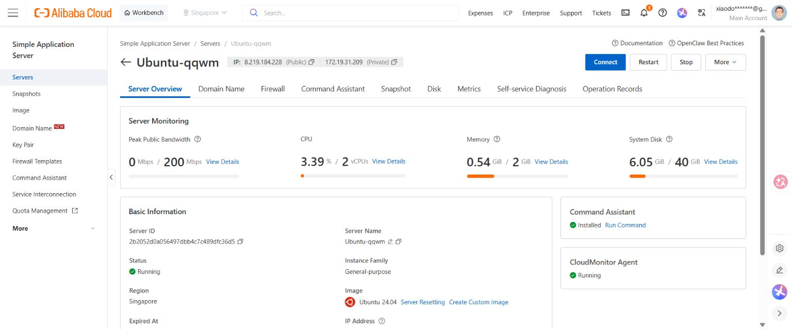
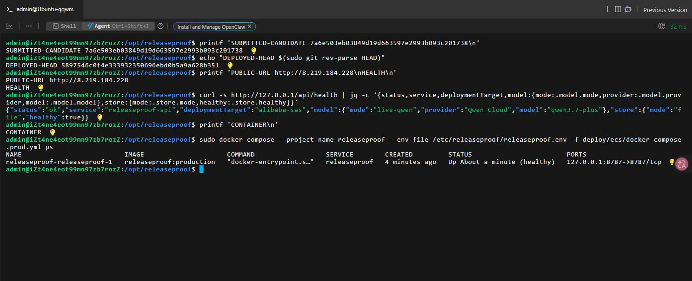
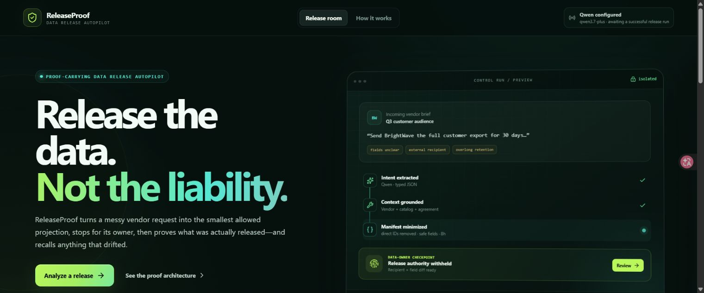

# Deployment and Qwen evidence

This page records the evidence available for the ReleaseProof submission and the limits of that evidence. Links were checked from outside the host on July 21, 2026.

## Verified release status

- Public repository: [github.com/xiaodouzi666/releaseproof](https://github.com/xiaodouzi666/releaseproof)
- Immutable application candidate: [`7a6e503eb03849d19d663597e2993b093c201738`](https://github.com/xiaodouzi666/releaseproof/commit/7a6e503eb03849d19d663597e2993b093c201738)
- Alibaba Cloud application: [http://8.219.184.228](http://8.219.184.228)
- Public health endpoint: [http://8.219.184.228/api/health](http://8.219.184.228/api/health)
- Public demo video: [youtu.be/s64eo9D5PYc](https://youtu.be/s64eo9D5PYc)
- Candidate validation: **69/69 automated tests** and **16/16 deterministic policy cases**, with typecheck, production build, and production dependency audit passing

The application and health endpoint are currently served over HTTP; TLS is not claimed. The runtime is an Alibaba Cloud Simple Application Server deployment and truthfully reports `deploymentTarget: alibaba-sas`.

## Qwen evidence boundary

The public runtime has a server-side Qwen Cloud client configured as `live-qwen` with `qwen3.7-plus`. The source implements structured extraction and read-only function planning against the Qwen OpenAI-compatible endpoint.

Successful model inference has **not** been established. Calls from the deployment currently fail closed with HTTP 403 `AccessDenied.Unpurchased` while Alibaba account KYC/entitlement activation remains pending. The health response proves that the client, provider mode, model, service, store, and deployment target are configured; it does not prove that a model response completed. No screenshot, workflow receipt, evaluation number, or submission text should be described as successful live-Qwen evidence.

The deterministic recorded-demo path remains the reproducible end-to-end demonstration of policy, owner approval, synthetic share creation, exact-state verification, recall, metrics, and audit. Its output is not represented as Qwen output.

## Judge evidence index

| Requirement | Evidence | Status |
| --- | --- | --- |
| Public source code | [Repository](https://github.com/xiaodouzi666/releaseproof) | Verified public |
| OSI license | [Candidate-pinned MIT license](https://github.com/xiaodouzi666/releaseproof/blob/7a6e503eb03849d19d663597e2993b093c201738/LICENSE) | Verified |
| Immutable application revision | [Candidate commit](https://github.com/xiaodouzi666/releaseproof/commit/7a6e503eb03849d19d663597e2993b093c201738) | Verified public |
| Qwen client and base URL | [Candidate-pinned `server/qwen.ts`](https://github.com/xiaodouzi666/releaseproof/blob/7a6e503eb03849d19d663597e2993b093c201738/server/qwen.ts) | Implementation verified; successful call not claimed |
| Structured extraction schema/request | [`server/qwen.ts` schema](https://github.com/xiaodouzi666/releaseproof/blob/7a6e503eb03849d19d663597e2993b093c201738/server/qwen.ts#L12-L23) and [request](https://github.com/xiaodouzi666/releaseproof/blob/7a6e503eb03849d19d663597e2993b093c201738/server/qwen.ts#L296-L339) | Source verified |
| Read-only planning and sanitization | [Planning request](https://github.com/xiaodouzi666/releaseproof/blob/7a6e503eb03849d19d663597e2993b093c201738/server/qwen.ts#L342-L427), [validation/rebinding](https://github.com/xiaodouzi666/releaseproof/blob/7a6e503eb03849d19d663597e2993b093c201738/server/qwen.ts#L429-L466), and [dispatch](https://github.com/xiaodouzi666/releaseproof/blob/7a6e503eb03849d19d663597e2993b093c201738/server/workflow-service.ts#L482-L528) | Source verified |
| Deterministic release policy | [Candidate-pinned `server/policy.ts`](https://github.com/xiaodouzi666/releaseproof/blob/7a6e503eb03849d19d663597e2993b093c201738/server/policy.ts) | 16/16 local cases |
| Exact manifest owner checkpoint | [Candidate-pinned workflow service](https://github.com/xiaodouzi666/releaseproof/blob/7a6e503eb03849d19d663597e2993b093c201738/server/workflow-service.ts) | Source and tests verified |
| Idempotent share, verification, and recall | [Candidate-pinned tools](https://github.com/xiaodouzi666/releaseproof/blob/7a6e503eb03849d19d663597e2993b093c201738/server/tools.ts) and [workflow service](https://github.com/xiaodouzi666/releaseproof/blob/7a6e503eb03849d19d663597e2993b093c201738/server/workflow-service.ts) | Source and tests verified |
| Alibaba Cloud resource | [Resource capture](assets/deployment/alibaba-cloud-resource.jpg) | Captured |
| Running candidate container | [Current runtime capture](assets/deployment/alibaba-cloud-runtime-current.jpg) | Captured; candidate SHA, deployed repository head, and healthy service visible |
| Public application | [Live app](http://8.219.184.228) and [public-app capture](assets/deployment/public-app.jpg) | Verified over HTTP |
| Public health | [Health endpoint](http://8.219.184.228/api/health) | Verified HTTP 200 |
| Successful live-Qwen receipt | None | Not achieved; HTTP 403 `AccessDenied.Unpurchased` while KYC/entitlement activation is pending |
| Test/evaluation output | [Validation record](evaluation.md#validated-releaseproof-candidate-snapshot) and [candidate evaluation source](https://github.com/xiaodouzi666/releaseproof/blob/7a6e503eb03849d19d663597e2993b093c201738/server/evaluation.ts) | 69/69 tests; 16/16 cases |
| Demo video | [Public YouTube video](https://youtu.be/s64eo9D5PYc) | Public link verified |
| Architecture and thumbnail | [Candidate architecture](https://github.com/xiaodouzi666/releaseproof/blob/7a6e503eb03849d19d663597e2993b093c201738/public/architecture.png) and [candidate 3:2 thumbnail](https://github.com/xiaodouzi666/releaseproof/blob/7a6e503eb03849d19d663597e2993b093c201738/public/devpost-thumbnail-3x2.png) | Candidate-pinned assets |

## What the implementation does with Qwen Cloud

ReleaseProof targets the Qwen Cloud OpenAI-compatible Chat Completions endpoint:

~~~text
POST https://dashscope-intl.aliyuncs.com/compatible-mode/v1/chat/completions
model: qwen3.7-plus
~~~

The designed live path makes two logical requests:

1. **Structured extraction:** request prose and optional imagery become a validated recipient, dataset, purpose, field/action set, TTL, release tier, optional agreement reference, confidence, and source mode.
2. **Read-only evidence planning:** Qwen may select recipient, dataset, current-share, and optional agreement lookups.

The plan is untrusted. The server allow-lists names, parses strict arguments, rebinds identifiers to validated extraction values, adds mandatory reads, and dispatches the sanitized plan before deterministic policy. Qwen is never offered a share-create, recall, approval, credential, or policy-override function.

Candidate-pinned source:

- [Client, endpoint, model, and provider disclosure](https://github.com/xiaodouzi666/releaseproof/blob/7a6e503eb03849d19d663597e2993b093c201738/server/qwen.ts#L254-L293)
- [Structured extraction](https://github.com/xiaodouzi666/releaseproof/blob/7a6e503eb03849d19d663597e2993b093c201738/server/qwen.ts#L296-L339)
- [Read-plan request](https://github.com/xiaodouzi666/releaseproof/blob/7a6e503eb03849d19d663597e2993b093c201738/server/qwen.ts#L342-L427)
- [Plan validation, argument rebinding, and mandatory reads](https://github.com/xiaodouzi666/releaseproof/blob/7a6e503eb03849d19d663597e2993b093c201738/server/qwen.ts#L429-L466)
- [Tool dispatch](https://github.com/xiaodouzi666/releaseproof/blob/7a6e503eb03849d19d663597e2993b093c201738/server/workflow-service.ts#L482-L528)
- [Deterministic policy](https://github.com/xiaodouzi666/releaseproof/blob/7a6e503eb03849d19d663597e2993b093c201738/server/policy.ts)
- [Share, verification, and recall adapter](https://github.com/xiaodouzi666/releaseproof/blob/7a6e503eb03849d19d663597e2993b093c201738/server/tools.ts)

Official references:

- [Qwen Cloud first API call](https://docs.qwencloud.com/developer-guides/getting-started/first-api-call)
- [Qwen structured output](https://www.alibabacloud.com/help/en/model-studio/qwen-structured-output)
- [Qwen function calling](https://www.alibabacloud.com/help/en/model-studio/qwen-function-calling)
- [Qwen visual understanding](https://www.alibabacloud.com/help/en/model-studio/vision-model)

## Public health evidence

The public check is:

~~~bash
curl --fail --silent http://8.219.184.228/api/health
~~~

The verified response reports these stable fields:

~~~json
{
  "status": "ok",
  "service": "releaseproof-api",
  "version": "0.1.0",
  "deploymentTarget": "alibaba-sas",
  "model": {
    "mode": "live-qwen",
    "provider": "Qwen Cloud",
    "model": "qwen3.7-plus"
  },
  "store": {
    "mode": "file",
    "healthy": true
  }
}
~~~

Again, this response establishes configuration and service identity only. The missing successful workflow receipt, combined with the observed 403 `AccessDenied.Unpurchased`, means no successful inference claim is made.

## Captured Alibaba Cloud evidence

### Resource console

The capture shows the Alibaba Cloud Simple Application Server product, Singapore region, running status, and public IP. Account and billing secrets are not shown.

### Candidate runtime

The capture shows executable candidate `7a6e503eb03849d19d663597e2993b093c201738`, deployed repository head `5897546c0f4e333932350696ebd0b5a9a628b351`, the public URL, and a healthy container. It also shows the non-secret health result, including `alibaba-sas`, `live-qwen`, Qwen Cloud, `qwen3.7-plus`, and healthy file persistence.

### Public application

The capture shows ReleaseProof served from the public IP. Its provider badge says Qwen is configured and is awaiting a successful release run; it is not a completed live workflow capture.

No successful Qwen monitoring capture or completed live-Qwen workflow receipt is included because the 403 `AccessDenied.Unpurchased` response prevents one while KYC/entitlement activation is pending. No verified-recall cloud screenshot is claimed. The public video and local deterministic path demonstrate the product flow without relabeling fixtures as live model output.

## Reproduce candidate validation

~~~bash
git checkout 7a6e503eb03849d19d663597e2993b093c201738
pnpm install --frozen-lockfile
pnpm typecheck
pnpm test
pnpm eval
pnpm audit --prod
pnpm build
curl --fail --silent http://8.219.184.228/api/health
~~~

The July 20, 2026 candidate run passed typecheck, 8/8 test files and 69/69 tests, 16/16 deterministic evaluation cases, production dependency audit with no known vulnerabilities, and production build. See [evaluation.md](evaluation.md) for scope and limitations.

## Publication QA

- Repository, candidate commit, application, health endpoint, and video links were reachable when checked.
- Source links are pinned to the candidate SHA.
- The public URL is HTTP, not HTTPS.
- Health exposes no credential or environment-file content.
- All product data shown is synthetic.
- The Alibaba Cloud resource, runtime, and public application captures are present.
- Qwen configuration is distinguished from successful inference.
- Recall means revoking the synthetic share; it does not guarantee downstream deletion.
- The submitted Devpost project includes the accepted-format Alibaba Cloud screenshot; the entrant completed the legal/profile fields directly in Devpost.
