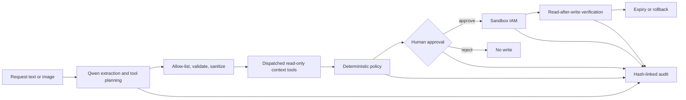

# Devpost submission copy

This is ready-to-paste editorial copy, with clearly marked evidence fields that must be replaced after deployment. Do not publish any bracketed `PENDING` value.

**Project status:** New project — GrantGuard was designed and built during this hackathon period.

## Project name

GrantGuard

## Tagline

Human-gated, least-privilege access autopilot powered by Qwen Cloud.

## Thumbnail

Upload [`public/devpost-thumbnail-3x2.png`](../public/devpost-thumbnail-3x2.png). It is a 1536x1024 (3:2) PNG, below Devpost's 5 MB limit, with no third-party logos or account information. The wider [`public/devpost-thumbnail.png`](../public/devpost-thumbnail.png) is the repository/social cover.

## Track

Track 4 - Autopilot Agent

## One-line description

GrantGuard turns an ambiguous access ticket into a grounded, policy-bounded, temporary access change with human approval, verification, rollback, and a tamper-evident audit trail.

## Try it out

- Live application: `[PENDING: public HTTPS URL]`
- Source code: `[PENDING: public GitHub repository]`
- Demo video (strictly under 3 minutes): `[PENDING: public YouTube URL; verify signed-out playback]`
- Qwen integration permalink: `[PENDING: commit-pinned GitHub link]`
- Alibaba Cloud deployment evidence: `[PENDING: commit-pinned code link showing the Qwen Cloud base URL, plus the Devpost-uploaded Alibaba Cloud runtime screenshot]`

## Inspiration

An access request often starts as a single vague sentence: "Give Alex production access for the migration." The operator reading it has to answer a dozen questions before touching IAM. Which Alex? Which resource? What does "access" mean? Is the subject active, MFA-enrolled, and cleared for that data? What do they already have? What is the smallest useful scope? How long should it last? Who approves it? Did the provider actually apply it? How will it be revoked and audited?

This is a good agent problem, but it is also a dangerous place to give a model unchecked autonomy. We built GrantGuard around that tension. Qwen handles ambiguity, multimodal understanding, structured extraction, and tool planning. Deterministic software owns hard authorization. A human owns the side-effect boundary. Verification owns the definition of success.

## What it does

GrantGuard is an operator workbench for temporary access changes:

1. A requester pastes free-form text or supplies a ticket image.
2. Qwen converts the request into a typed access intent, then uses function calling to propose narrow, read-only directory, governed-resource, and current-access lookups plus optional reference-only ticket evidence.
3. The server allow-lists those functions, validates and sanitizes their arguments against the extracted subject/resource, adds any mandatory read Qwen omitted, and dispatches the actual calls.
4. A deterministic policy engine independently evaluates the grounded request. It can reduce role, actions, and duration, require approval, or deny the request. Qwen cannot override it.
5. The UI presents risk findings, the exact before/after diff, expiry, and tool evidence to a human.
6. Approval triggers an idempotent write to a Sandbox IAM adapter. Rejection ends the workflow without a write.
7. GrantGuard reads the state back and reports completion only when observed access matches the approved plan.
8. The operator can roll back the grant and receives read-after-revoke verification.
9. A hash-linked audit timeline records model, tool, policy, approval, write, verification, and rollback events.

The same interface includes a deterministic 16-case policy evaluation and operational telemetry for workflow outcomes, tool success, latency, provider mode, and Qwen usage metadata.

## How we built it

GrantGuard is a TypeScript application with a React/Vite workbench and an Express API. The production build is one Node.js container: Express serves both the static frontend and `/api/*`, keeping the Model Studio credential on the server and simplifying deployment.

The agent pipeline is a typed state machine:

```text
queued -> extracting -> function planning -> enriching context -> evaluating policy
evaluating policy -> denied
evaluating policy -> awaiting approval -> approved -> executing -> verifying -> completed
awaiting approval -> rejected
completed -> rollback -> rolled back
```

When a valid Model Studio key is configured, the server-side adapter calls Alibaba Cloud Model Studio's OpenAI-compatible Chat Completions endpoint with `qwen3.7-plus`. One request uses structured JSON output for intent extraction; a second uses a narrow function catalogue for context planning. Extraction fields and function arguments cross strict validation boundaries, and the server replaces tool identifiers with trusted values before dispatch. `qwen3.6-flash` is configured as a lower-latency fallback, and each workflow records its provider mode, model, fallback state, token counts, and latency. A successful live invocation still requires the evidence linked below; this draft does not claim one.

The deterministic policy engine evaluates identity state, MFA, employment type, clearance, resource classification/environment, allowed roles/actions, current access, and duration. Its output contains a risk score/tier, explicit findings, an effective least-privilege scope, and a hard outcome. Write tools are deliberately not available to Qwen.

The Sandbox IAM adapter uses a stable idempotency key so retries cannot create a second grant. A separate verifier queries observed state after grant or revoke. Audit events commit to the previous event hash, making later edits/reordering detectable within the chain.

If no Model Studio key is available, the application enters clearly labeled `recorded-demo` mode. Only extraction/function selection is replaced by deterministic fixtures; the orchestrator still dispatches the same context reads, and policy, approval, execution, verification, rollback, metrics, and audit use the same code. We never represent fixture output as a live Qwen call.

Deployment assets include a multi-stage Docker image, hardened Compose/Nginx examples for Alibaba Cloud ECS or Simple Application Server, health checks, and an explicitly non-production Function Compute architecture experiment. The submitted live path is ECS/SAS only because it supports the current persistent state and background expiry model.

## How we used Qwen Cloud

Qwen is not decorative in this project. It sits exactly where conventional rules are weakest: understanding unstructured, potentially multimodal intent and deciding which evidence to retrieve.

- **Visual and text understanding:** interpret a ticket screenshot plus accompanying prose.
- **Structured output:** emit a parseable access-request object rather than prose that code must guess at.
- **Function calling:** choose from allow-listed, read-only directory/resource/current-access tools plus optional ticket lookup. The orchestrator validates and rebinds arguments, completes the three-read grounding baseline, discards unbound ticket calls, and actually dispatches the plan before policy runs. Ticket evidence never authorizes scope.
- **Deterministic evidence:** the policy engine and diff calculator, not Qwen, produce the findings and before/after evidence rendered for the operator.
- **Fallback-aware operation:** capture which Qwen model answered, rather than silently mixing model behavior.

The authorization decision itself is intentionally not delegated to Qwen. This division makes the model more useful because operators can trust where its responsibility ends.

Live API source: `[PENDING: commit-pinned source link]`

Live invocation/deployment evidence: `[PENDING: evidence link]`

## Architecture

Use [`public/architecture.png`](../public/architecture.png) as the Devpost architecture image; it is a 1600x900 static export of the corrected extraction, Qwen read-plan, context, policy, approval, IAM, and verification flow.



## Challenges we ran into

### Making an agent useful without making it authoritative

The obvious implementation would let the model call a grant tool. We rejected that architecture. Instead, we separated tools into two planes: Qwen can plan only with read-only tools, while the server owns policy, approval, and writes. That required a more explicit state machine, but it made every transition testable and legible in the UI.

### Defining "done" for an external change

A successful API response does not prove the requested state exists. We modeled grant and rollback as sagas: execute idempotently, then read the provider state and compare it with the approved expectation. A mismatch fails closed instead of producing a reassuring green check.

### Preserving an honest offline demo

Hackathon demos are often evaluated when quotas, keys, or networks are unreliable. We wanted the complete safety workflow to remain testable without pretending fixtures were AI. Recorded-demo mode is disclosed in health, workflow metadata, and UI; the deterministic fixture replaces only model extraction/planning.

### Explaining safety in under three minutes

The interface is organized around evidence: normalized intent, context tools, policy findings, diff, human checkpoint, verification, and audit. The operator sees the chain of custody instead of a chat transcript.

## Accomplishments that we're proud of

- A real separation between probabilistic understanding and deterministic authority.
- A human approval boundary enforced by server state, not just a confirmation modal.
- Idempotent, temporary, reversible sandbox grants with read-after-write and read-after-revoke verification.
- Per-workflow disclosure of live Qwen versus recorded-demo mode.
- Hash-linked audit events that make the full agent/tool/control sequence inspectable.
- A deterministic 16-case safety regression suite plus 62 passing automated policy, adapter, API, persistence, Qwen-boundary, and frontend-normalization tests on the validated code commit.
- A hardened one-container deployment path for Alibaba Cloud ECS/SAS; the repository also documents why its experimental Function Compute manifest is not a valid live path for this stateful release.

## What we learned

The best safety control was not a longer prompt. It was reducing the model's authority. Once writes were moved outside the Qwen tool loop, we could use the model aggressively for ambiguity and still reason precisely about the side-effect path.

We also learned that observability is part of the product. Provider mode, fallback use, tool traces, policy version, idempotency, observed state, and audit hashes are not backend trivia; they are what lets an operator decide whether to trust an agent-assisted change.

Finally, we learned to treat demos as evidence. A fixture is valuable for reproducibility, but it must be labeled. A write response is useful, but it is not verification. A hash chain is tamper-evident, but it is not immutable unless externally anchored. Honest boundaries make the project stronger.

## What's next

The next step is a pilot that remains read-only against a real identity provider and cloud IAM. Before enabling real writes, we would add SSO, approver RBAC and separation of duties, proposal revision signatures, CSRF/replay/rate-limit protections, a transactional workflow store, a durable expiry scheduler, KMS-managed secrets, provider-scoped service identities, and an externally anchored append-only audit log.

We would then connect Slack/Teams and ticketing systems for intake, add owner/manager routing, evaluate Qwen extraction on a consented multilingual screenshot corpus, and support policy packs for Alibaba Cloud RAM, AWS IAM, and Kubernetes RBAC.

## Built with

- Alibaba Cloud Model Studio / Qwen Cloud
- Qwen 3.7 Plus and Qwen 3.6 Flash fallback
- TypeScript
- React 19
- Vite
- Express
- Zod
- OpenAI-compatible API client
- Vitest and Supertest
- Docker / Docker Compose
- Alibaba Cloud ECS or Simple Application Server
- Alibaba Cloud Function Compute custom-container experiment (not used for submission)
- Nginx

## Submission evidence reminder

Before pasting this copy, replace every pending field and verify the following from a signed-out browser:

- public source and MIT license;
- commit-pinned Qwen API source link;
- public Alibaba Cloud-hosted health endpoint and application;
- the required PNG/JPG/JPEG screenshot showing the Alibaba Cloud Workbench/instance runtime, plus repository-hosted resource and running-commit evidence;
- live-Qwen workflow visibly labeled as live, not recorded-demo;
- current test/evaluation output without invented pass rates;
- public YouTube demo strictly under 3:00 that plays while signed out;
- no repository, video, live-app, or evidence-link changes after the submission deadline.
